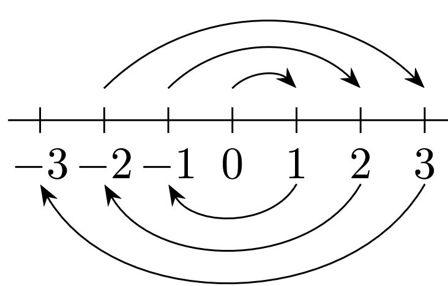
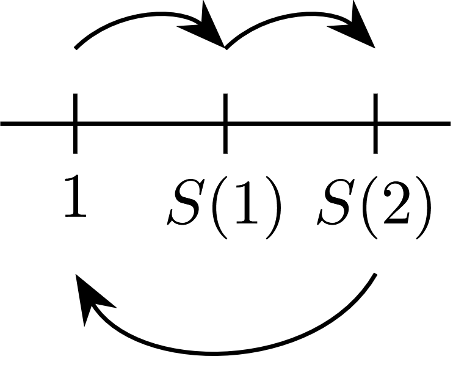
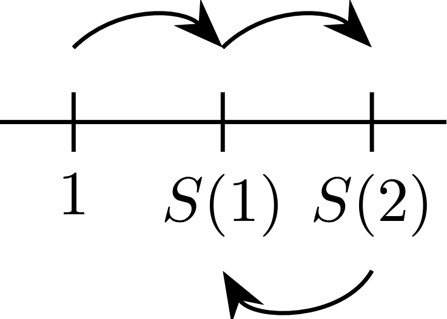
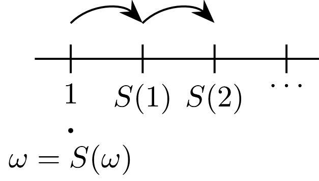

# The Natural Numbers

In this chapter natural numbers will by synonym of the positive integers, $\mathbb{P}$. That is, $1, 2, 3, \ldots$, where are one of the most familiar mathematical objects. 

The objective of this chapter is to develop an axiomatic theory of the natural numbers following [@mendelson_introduction_2015, chap. 2].

## Peano systems

::: {#def-peano-system}

A **Peano system** is a triple $(\mathbb{P}, 1, S)$ where $\mathbb{P}$ is a non empty set where $1 \in \mathbb{P}$ and $S$ is a singulary operation on $\mathbb{P}$, $S: \mathbb{P} \longrightarrow \mathbb{P}$, such that the following axioms are satisfied:

i. $1$ is not the successor $S(x)$ of any object $x \in \mathbb{P}$. In symbols, $\forall x(S(x) \neq 1)$ or $1 \not \in \mathscr{R}(S)$.

ii. Different objects in $\mathbb{P}$ have different successors. This can be formulated as follows:

    $$
    \forall x \forall y (x \neq y \Longrightarrow S(x) \neq (S(y)))
    $$
    
iii. Principle of Mathematical Induction: Any subset of $\mathbb{P}$ containing $1$ and closed under the successor operation (See @exr-binary-operation 1. and applied for a singulary operation) must be identical to $\mathbb{P}$. This can be formulated as follows:
    
     $$\forall B ((B \subseteq \mathbb{P} \land 1 \in B \land \forall x(x \in B \Longrightarrow S(x) \in B)) \Longrightarrow \mathbb{P} = B)$$

**Note**: In the triple $(\mathbb{P}, 1, S)$ the set $\mathbb{P}$ is called the underlying  set, $S$ the successor operation, and $1$ the distinguished element. The distinguished element $1$ need not have anything to do with the ordinary integer $1$. 

:::

::: {#exm-peano-systems}

1. Let $\mathbb{P}$ be the set of natural numbers. $1$ is to denote the ordinary integer $1$. $S$ is the operation of adding $1$: $S(x) = x + 1$ for all $x \in \mathbb{P}$. This example will be called the standard Peano system. 

   If $x \in \mathbb{P}$ then $x + 1 \neq 1$. Also if $x \neq y$ then $x + 1 \neq y + 1$. Furthermore, let $B \subseteq \mathbb{P}$, $1 \in B$ and if $x \in B$ then $x + 1 \in B$. Therefore $B = \mathbb{P}$.
   
2. Let $\mathbb{P}$ be the set of all integers greater than or equal to $1000$. $1$ is to denote the integer $1000$. $S$ is the operation of adding the ordinary integer $1$. Thus $S(1000) = 1001$, $S(1001) = 1002$ and so on.

3. Let $\mathbb{P}$ be the set of negative integers. $1$ is to denote the integer $-1$ and $S$ is the operation of subtracting $1$.  Thus $S(-1) = -2$, $S(-2) = -3$ and so on.  

4. Let $\mathbb{P}$ be the set of even positive integers. Let $1$ denote the integer $2$. $S$ is to be the operation of adding $2$. Thus, $S(2) = 4$, $S(4)$ and so on.

:::

::: {#thm-x-different-1-is-a-successor}

Every element different from $1$ is a successor. This can be formulated as:

$$\forall x (x = 1 \lor \exists y (x = S(y)))$$

:::

::: {.proof}

Let $B = \{ x \in \mathbb{P}: x = 1 \lor \exists y (x = S(y)) \}$. Then we must show that $B = \mathbb{P}$.

We have that $1 \in B$. Now assume $x \in B$ then $x \in \mathbb{P}$. Because $S: \mathbb{P} \longrightarrow \mathbb{P}$ then $S(x) \in \mathbb{P}$ where $S(x) \neq 1$. So if $x = y$ it exists some $y$ such that $S(x) = S(y)$. Therefore $S(x) \in B$ which means that $B = \mathbb{P}$ by @def-peano-system iii.

:::

::: {#thm-no-object-is-its-own-successor}

No object is its own successor, that is, $\forall x (S(x) \neq x)$.

:::

::: {.proof}

Let $B = \{ x \in \mathbb{P}: S(x) \neq x \}$. Then we must show that $B = \mathbb{P}$.

We have that $1 \in B$ because $S(1) \neq 1$ by @def-peano-system i. Also let $x \in B$ so $x \in \mathbb{P}$ and $S(x) \neq x$. Furthermore $S(x) \in \mathbb{P}$ because $S: \mathbb{P} \longrightarrow \mathbb{P}$. By @def-peano-system ii $S(S(x)) \neq S(x)$ so $S(x) \in B$. Finally by @def-peano-system iii $B = \mathbb{P}$. 

:::

::: {#exr-peano-systems}

1. Prove that every object different from $1$ is the successor for a unique object, that is, 

   $$\forall x (x = 1 \lor \exists !y (x = S(y)))$$

2. Prove $\forall x (x = 1 \lor x = S(1) \lor \exists y (x = S(S(y))))$

3. Determine whether or not the following structures $(\mathbb{P}, S, 1)$ are Peano Systems:

    a. $\mathbb{P}$ is a set of all integers greater than $9$. $1$ stands for the integer $10$. $S(u) = u + 1$ for any $u \in P$, that is $S$ is the operation of adding the ordinary integer $1$.
    
    b. $\mathbb{P}$ is a set of all integers. $1$ stands for the ordinary integer $1$. $S(u) = u + 1$ for any $u \in P$.
    
    c. $\mathbb{P}$ is the set of all integers. $1$ stands for the ordinary integer $0$ and $S(u)$ is defined us:
        
       $$S(u) = \begin{cases}
                 1      & \text{if} u = 0 \\
                 -u     & \text{if} u > 0 \\
                 -(u-1) & \text{if} u < 0
                \end{cases}$$
                
       {#fig-successor-integers fig-align="center" width=40%}

    d. $\mathbb{P}$ is the set of rational numbers of the form $\frac{1}{2^n}$ where $n$ is a non negative integer. $1$ stands for the integer $1$. Also $S(u) = \frac{1}{2}u$ for all $u \in \mathbb{P}$.
    
    e. $\mathbb{P} = \{ 1, 2, 3, 4 \}$. $1$ stands for the integer $1$. Also $S(1) = 2$, $S(2) = 3$, $S(3) = 4$ and $S(4) = 1$.

    f. $\mathbb{P} = \{ 1, 2, 3, \ldots \} \cup \{ 1\#, 2\#, 3\#, \ldots \}$ where $1\#$, $2\#$, $3\#$, $\ldots$ are pairwase distinct new objects different from the natural numbers. Let $1$ denote the integer 1. Let $S(n) = n + 1$ for any positive integer $n$ and let $S(n\#) = (n + 1)\#$ for any positive integer $n$. Thus, $S(1) = 2$, $S(2) = 3$, $\ldots$, and $S(1\#) = 2\#$, $S(2\#) = 3\#$, $\ldots$

:::

::: {#sol-peano-systems}

1. By @thm-no-object-is-its-own-successor we have that:

   $$\forall x (x = 1 \lor \exists y (x = S(y)))$$
   Now assume that $x = S(y)$ and $x = S(w)$ so $S(y) = S(w)$. By @def-peano-system ii $y = w$. Therefore:
   
   $$\forall x (x = 1 \lor \exists !y (x = S(y)))$$

2. We have that $1 \in B$. Now assume $y \in B$ then $y \in \mathbb{P}$. Because $S: \mathbb{P} \longrightarrow \mathbb{P}$ then $S(y) \in \mathbb{P}$ where $S(y) \neq 1$. Furthermore by @def-peano-system ii $S(S(y)) \neq S(1)$. 

   If $y = 1$ then $S(1) \neq 1$ and by @thm-x-different-1-is-a-successor $x = S(1)$.
   
   Also if $S(S(y))$ and $y \neq 1$ by @thm-x-different-1-is-a-successor $\exists y (x = S(S(y)))$. Therefore:
   
   $$\forall x (x = 1 \lor x = S(1) \lor \exists y (x = S(S(y))))$$

3. In each $(\mathbb{P}, S, 1)$ we have the following results

    a. Because $\mathbb{P} = \{ u : u > 9 \land u \text{ is an integer} \}$. 
   
        - First $S(u) = u + 1$ where $u \in \mathbb{P}$ then $S(u) \neq 10$. Because if $u + 1 = 10$ then $u = 9$ but $9 \not \in \mathbb{P}$.
   
        - Also let $S(u) = S(v)$ so $u + 1 = v + 1$ which means that $u = v$.
      
        - Finally let $10 \in B \subseteq \mathbb{P}$ and if $u \in B$ then $u + 1 \in B$. 
      
            - Let $v \in \mathbb{P}$ so we need to prove that $v \in B$. Define $A = \{ x \in \mathbb{P} \mid 10 \leq x \leq v \}$ and let $B \cap A$
         
                - First, we have that $B \cap A \subseteq A$ so by @thm-finite-set b $B \cap A$ must be finite. Furthermore $B \cap A \neq \emptyset$ because $10 \in B$ and $10 \in A$.
         
                - Second, because $B \cap A$ is finite, $B \cap A \subseteq \mathbb{P}$ and $B \cap A \neq \emptyset$ it must have a greatest element $k$ by @exr-finite-sets 6.
         
                    - If $k = v$ then $v \in B$
            
                    - If $k < v$ and because $k \in B \cap A$ then $k \in B$. Because of the properties of $B$ then $k + 1 \in B$. Also this means that $10 \leq k + 1 \leq v$ so $k + 1 \in A$ but this will mean that $k + 1 \in B \cap A$. However $k + 1 > k$ so $k$ will not be the greatest element. Because we arrive to a contradiction we discard that $k < v$. 

    b. The proof is similar to @sol-peano-systems 3 a but with $1$ instead of $10$ and $\mathbb{P} = \{ u : u > 0 \land x \text{ is an integer} \}$
    
    c. Let $\mathbb{P} = \mathbb{Z}$
    
        - Because $S(u) = 1, S(u) = -u < 0$ or $S(u) = -(u - 1) > 1$ then $S(u) \neq 0$
    
        - Also if $S(u) = S(v)$ then $1 = 1$ so $u = v = 0$, $-u = -v$ so $u = v$ or $-(u - 1) = -(v - 1)$ so $u = v$.
       
        - Finally let $0 \in B \subseteq \mathbb{P}$ and if $u \in B$ then $S(u) \in B$. 
        
           - Let $v \in \mathbb{P}$ so we need to prove that $v \in B$. Lets define the set $A$ in the following way:
        
             $$A = \begin{cases}
                    \{x \in \mathbb{P} \mid -(v - 1) \leq x \leq v \} & \text{ if } v > 0 \\
                    \{x \in \mathbb{P} \mid v \leq x \leq -v \} & \text{ if } v \leq 0
                   \end{cases}$$

              - First, we have that $B \cap A \subseteq A$ so by @thm-finite-set b $B \cap A$ must be finite. Furthermore $B \cap A \neq \emptyset$ because $0 \in B$ and $0 \in A$.
              
              - Second, because $B \cap A$ is finite and $B \cap A \neq \emptyset$ it must have a greatest element $k$ and a least element $l$ by extending the result in @exr-finite-sets 6.
              
                 - If $k = v > 0$ or $l = v \leq 0$ then $v \in B$
                 
                 - If $k < v$ and $v > 0$ because $k \in B \cap A$ then $k \in B$. Also because of the properties of $B$ then $S(k) \in B$. 
                 
                    - If $k = 0$ then $S(k) = 1 \in B$ and $-(v - 1) \leq 1 \leq v$ so $1 \in A$ but this will mean that $1 \in B \cap A$. However $1 > 0$ so $0$ will not be the greatest element. Because we arrive to a contradiction we discard that $k < v$ when $k = 0$.
                    
                    - If $k > 0$ then $S(k) = -k \in B$ and $S(-k) = -(-k - 1) = k + 1 \in B$. Therefore $-(v - 1) \leq k + 1 \leq v$ so $k+1 \in A$ but this will mean that $k+1 \in B \cap A$. However $k+1 > k$ so $k$ will not be the greatest element. Because we arrive to a contradiction we discard that $k < v$ when $k > 0$.
                    - If $k < 0$ then we discard this case because $0 \in B \cap A$ so if $k < 0$ it can not be the greatest element. 

                 - If $v < l$ and $v \leq 0$ because $l \in B \cap A$ then $l \in B$. Also because of the properties of $B$ then $S(l) \in B$.

                    - If $l = 0$ then $S(l) = 1 \in B$ and $S(1) = -1$. Therefore $v \leq -1 \leq -v$ so $-1 \in A$ but this will mean that $-1 \in B \cap A$. However $-1 < 0$ so $0$ will not be the least element. Because we arrive to a contradiction we discard that $v < l$ when $l = 0$.

                    - If $l > 0$ then we discard this case because $0 \in B \cap A$ so if $l > 0$ it can not be the least element.

                    - If $l < 0$ then $S(l) = -(l - 1) = -l + 1 \in B$ and $S(-l + 1) = l - 1 \in B$. Therefore $v \leq l - 1 \leq -v$ so $l - 1 \in A$ but this will mean that $l - 1 \in B \cap A$. However $l - 1 < l$ so $l$ will not be the least element. Because we arrive to a contradiction we discard that $v < l$ when $l < 0$.

    d. Let $\mathbb{P} = \{ u \mid u=\frac{1}{2^n} \land n \in \mathbb{Z}_{\geq 0} \}$
    
        - First $S(u) = \frac{1}{2}u$ where $u = \frac{1}{2^n}$ then $S(u) \neq 1$. Because if $\frac{1}{2}u = 1$ then $u = 2$ but $u = \frac{1}{2^n}$. So $u = 2$ will imply $\log_2 1 = n + 1$ but this is not true because $n \neq -1$.
        
        - Also let $S(u) = S(v)$ so $\frac{1}{2}u = \frac{1}{2}v$ which means that $u = v$. 
        
        - Finally let $1 \in B \subseteq \mathbb{P}$ and if $u \in B$ then $S(u) \in B$. 
      
            - Let $v \in \mathbb{P}$ so we need to prove that $v \in B$. Define $A = \{ x \in \mathbb{P} \mid v \leq x \leq 1 \}$ and let $B \cap A$
            
                - First, we have that $B \cap A \subseteq A$ so by @thm-finite-set b $B \cap A$ must be finite. Furthermore $B \cap A \neq \emptyset$ because $1 \in B$ and $1 \in A$.

                - Second, because $B \cap A$ is finite and $B \cap A \neq \emptyset$ it must have a least element $l$ by extending the result in @exr-finite-sets 6. 
         
                    - If $l = v$ then $v \in B$
            
                    - If $v < l$ and because $l \in B \cap A$ then $l \in B$. Because of the properties of $B$ then $S(l) = \frac{1}{2}l \in B$. Also this means that $v \leq \frac{1}{2}l \leq 1$ so $\frac{1}{2}l \in A$ but this will mean that $\frac{1}{2}l \in B \cap A$. However $\frac{1}{2}l < l$ so $l$ will not be the least element. Because we arrive to a contradiction we discard that $v < l$.  

    e. Because $\mathbb{P} = \{ 1, 2, 3, 4 \}$ and $S(1) = 2$, $S(2) = 3$, $S(3) = 4$, $S(4) = 1$ we have that this structure is not a peano system because:
    
        - $S(4) = 1$ 

    f. Because $\mathbb{P} = \{ 1, 2, 3, \ldots \} \cup \{ 1\#, 2\#, 3\#, \ldots \}$, $S(n) = n + 1$ and $S(n\#) = (n + 1)\#$ we have that this structure is not a peano system because:
    
        - Assume $1 \in B$ where $B = \{ 1, 2, 3, \ldots \} \subseteq \mathbb{P}$ and if $u \in B$ then $S(u) \in B$.
        
           - By @exr-peano-systems 3 b $B = \{ 1, 2, 3, \ldots \}$ where $B \neq \mathbb{P}$. 
:::

## Diagramatic interpretation of peano system axioms

Following [@enderton_elements_2009, p. 70] we can specify different interpretations of the axioms presented in @def-peano-system. 

In the case of the first axiom @def-peano-system i if $\mathbb{P} = \{ 1, 2, 3 \}$, $S(1) = 2$, $S(2) = 3$ and $S(3) = 1$ a representation of the violation of this axiom is represented in @fig-peano-axiom-1-violation:

{#fig-peano-axiom-1-violation fig-align="center" width=20%}

The axiom pointed out in @def-peano-system i avoid that you can return to the origin $1$ using the successor function $S$.

In the case of the second axiom @def-peano-system ii if $\mathbb{P} = \{ 1, 2, 3 \}$, $S(1) = 2$, $S(2) = 3$ and $S(3) = 2$ a representation of the violation of this axiom is represented in @fig-peano-axiom-2-violation:

{#fig-peano-axiom-2-violation fig-align="center" width=20%}

The axiom pointed out in @def-peano-system ii avoid that you can have loops using the successor function $S$.

In the case of the third axiom @def-peano-system iii if $\mathbb{P} = \{ 1, 2, 3, \ldots \} \cup \{ \omega \}$ where $\{ 1, 2, 3, \ldots \} \cap \{ \omega \} = \emptyset$ , $S(1) = 2$, $S(2) = 3$, $\ldots$, $\omega = S(\omega)$ a representation of the violation of this axiom is represented in @fig-peano-axiom-3-violation:

{#fig-peano-axiom-3-violation fig-align="center" width=30%}

The axiom pointed out in @def-peano-system iii avoid that you can not reach an element in $\mathbb{P}$ using the successor function $S$ and beginning at the origin $1$.

## The iteration theorem

Any arithmetical notions such as $+$ and $\times$ are not mentioned in @def-peano-system. These notions will be defined by induction. The idea of the definition by induction is different from that of proof by mathematical induction pointed out in @def-peano-system iii.

When we define a function $f$ by induction, we first specify $f(1)$ and then indicate a rule for obtaining $f(S(x))$ from the previous value $f(x)$. This determines a unique function $f$ defined on $\mathbb{P}$.

::: {#thm-iteration-theorem}

## Iteration theorem[^chapter_2-1]

Consider any peano system $(\mathbb{P}, S, 1)$. Let $W$ be an arbitrary set, let $c$ be a fixed element of $W$, and let $g$ be a singulary operation on $W$, that is $g: W \longrightarrow W$. Then, there is a unique function $F: \mathbb{P} \longrightarrow W$ such that:

a. $F(1) = c$
b. $F(S(x)) = g(F(x))$ for all $x \in \mathbb{P}$

:::

[^chapter_2-1]: Also known as the recursion theorem (See [@enderton_elements_2009, pp. 73-74]) where it can be found in [@dedekind_essays_1963, pp. 85-86]

::: {.proof}

- Existence of a suitable function $F$

  Take any $n \in \mathbb{P}$. A function $f: A \longrightarrow W$ is said to be $n$-admissible if and only if:
  
    i. $A \subseteq \mathbb{P}$
  
    ii. $1 \in A$
    
    iii. $n \in A$
    
    iv. $\forall u (S(u) \in A \Longrightarrow u \in A)$
    
    v. $f(1) = c$
    
    vi. $\forall u (S(u) \in A \Longrightarrow f(S(u)) = g(f(u)))$
    
        a. If $f$ is $S(n)$-admissible, then $f$ is $n$-admissible
        
           If conditions i, ii and iv-vi are fulfill for $S(n)$ they are also fulfill for $n$. The only condition that we need to check is iii, that is $n \in A$. Because $f$ is $S(n)$-admissible by iii $S(n) \in A$. Therefore by iv $n \in A$.
           
        b. For any $n \in \mathbb{P}$ there exists at least one $n$-admissible function.
        
           We shall prove this by mathematical induction using @def-peano-system i. Let $B$ be the set of all members $n \in P$  for which there exists at least one $n$-admissible function.
           
           We must show that $B = \mathbb{P}$. First, lets build a $1$-admissible function. Let $A = \{ 1 \}$ then $\{ 1 \} \subseteq \mathbb{P}$, $1 \in \{ 1 \}$, $S(1) \neq \{ 1 \}$ and $f(1) = c$. Therefore $f: \{ 1 \} \longrightarrow W$ is $1$-admissible.
           
           Second, assume $n \in B$. Then by assumption there is some $n$-admissible function $f$ such that $f: A \longrightarrow W$.
           
           Third, define a function $f^*$ such that for any $x \in A$ $f^*(x) = f(x)$ and if $S(n) \not \in A$ let $f^*(S(n)) = g(f(n))$. Note that if $S(n) \in A$ then by vi $f(S(u)) = g(f(u))$. Therefore, $f^*: A^* \longrightarrow W$ such that $A^* = A \cup \{ S(n) \}$ where $A \subseteq A^*$. So $A^* \subseteq \mathbb{P}$, $1 \in A^*$, $n \in A^*$, if $S(n) \not \in A$ then $S(n) \in A^*$ then $n \in A^*$, $f^*(1) = f(1) = c$ and if $S(n) \not \in A$ then $S(n) \in A^*$ implies that $f^*(S(n)) = g(f(n))$. This means that $f^*$ is $S(n)$-admissible.
           
           Thus, $S(n) \in B$. We have shown that if $n \in B$ then $S(n) \in B$. By @def-peano-system iii $B = \mathbb{P}$.

        c. If $f$ is $n$-admissible and $h$ is $n$-admissible then $f(n) = h(n)$.
        
           We shall prove this by mathematical induction. Let $Y = \{ n \in \mathbb{P} \mid (\forall f) (\forall g) ((f \text{ is } n\text{-admissible} \land (g \text{ is } n\text{-admissible} )) \Longrightarrow f(n) = g(n)) \}$. We must show that $Y = \mathbb{P}$ using @def-peano-system iii.
           
           First, $1 \in Y$ because $1 \in \mathbb{P}$ and if $f$ and $g$ are $1$-admissible then $f(1) = c = g(1)$.
           
           Second, assume $n \in Y$.
           
           Third, let $f$ and $h$ be $S(n)$-admissible. Then by a. $f$ and $h$ are $n$-admissible. Because $n \in Y$ then $f(n) = h(n)$. By vi. $f(S(n)) = g(f(n))$ but $f(n) = h(n)$ so $f(S(n)) = g(h(n))$. Again by vi. $f(S(n)) = h(S(n))$.Therefore $S(n) \in Y$ so $Y = \mathbb{P}$   
           
        d. For any $n \in \mathbb{P}$ by b. it  exists an $n$-admissible function $f$. 
           
           Let us define $F(n) = f(n)$. By c. the value of $F(n)$ does not depend upon the particular choice of the $n$-admissible function $f$.
           
           Because we choose any $n \in \mathbb{P}$ then $\mathscr{D}(F) = \mathbb{P}$. Also, $F(1) = f(1)$ for some $1$-admissible function $f$. But, $f(1) = c$. Hence we have that $F(1) = c$.
           
           In addition, $F(S(n)) = f(S(n))$ for some $S(n)$-admissible function $f$. By a. $f$ is also $n$-admissible where $F(n) = f(n)$. Also since $f$ is $S(n)$-admissible, $f(S(n)) = g(f(n))$ we have that $F(S(n)) = g(F(n))$.
           
           Therefore conditions a. and b. in @thm-iteration-theorem are satisfied by $F$.
           
           We must still show that the range of $F$ is included in $W$. Because for any $n \in \mathbb{P}$, $F(n) = f(n)$ for some $n$-admissible function $f$. Since $\mathscr{R}(f) \subseteq W$, it follows that $F(n) \in W$ for any $n \in \mathbb{P}$.

- Uniqueness of $F$

  Assume $F_1$ and $F_2$ are functions from $\mathbb{P}$ into $W$ satisfying conditions a. and b. in @thm-iteration-theorem.
  
  Let $K = \{ n \in \mathbb{P} \mid \land F_1(n) = F_2(n) \}$.
  
  First, $1 \in K$ because $F_1(1) = c = F_2(1)$.
  
  Second, assume $n \in K$ so $F_1(n) = F_2(n)$.
  
  Third, let $F_1(S(n))$ then $F_1(S(n)) = g(F_1(n))$. Therefore $g(F_1(n)) = g(F_2(n))$ which means that $g(F_2(n)) = F_2(S(n))$. So $F_1(S(n)) = F_2(S(n))$. 
  
  By @def-peano-system iii $K = \mathbb{P}$ so for all $n \in \mathbb{P}$ we have that $F_1(S(n)) = F_2(S(n))$. Also $\mathscr{D}(F_1) = \mathscr{D}(F_2)$ so by @exr-function 3 $F_1 = F_2$. 

:::

## Application of the iteration theorem: addition

::: {#thm-iteration-theorem-addition}
## Addition

Consider any Peano system $(\mathbb{P}, S, 1)$. Then there is a unique binary operation $+$ on $\mathbb{P}$ such that:

$(\alpha)$. $x + 1 = S(x)$ for all $x \in \mathbb{P}$

$(\beta)$. $x + S(y) = S(x + y)$ for all $x, y \in \mathbb{P}$

**Note**: We adopt the standard convention of writing $x + y$ instead of $+(x,y)$.
:::

::: {.proof}
To prove the existence take any $x$ in $\mathbb{P}$. Now apply @thm-iteration-theorem with $W = \mathbb{P}$, $c = S(x)$ and $g = S$. Therefore, there is a unique function $F: \mathbb{P} \longrightarrow \mathbb{P}$ such that:

a. $F(1) = c = S(x)$

b. $F(S(y)) = g(F(y)) = S(F(y))$ for any $y \in \mathbb{P}$

We denote this unique function $F$ by $f_x$, since is is determinated by $x$. Thus $f_x(1) = S(x)$ and $f_x(S(y)) = S(f_x(y))$ for any $y \in \mathbb{P}$. Now, let $x + y = f_x(y)$ for any $x, y \in \mathbb{P}$. Then, $x + 1 = f_x(1) = S(x)$, and $x + S(y) = f_x(S(y)) = S(f_x(y)) = S(x + y)$. Therefore:

a. $x + 1 = S(x)$ for any $x \in \mathbb{P}$
b. $x + S(y) = S(x + y)$ for any $x, y \in \mathbb{P}$

To prove the uniqueness of $+$, assume that there is another binary operation $h$ such that:

$$h(x, 1) = S(x) \text{ for all } x \in \mathbb{P}$$

$$h(x, S(y)) = S(h(x, y)) \text{ for all } x, y \in \mathbb{P}$$

Take any $x \in \mathbb{P}$. Let us prove that $h(x, y) = x + y$, for all $y \in \mathbb{P}$. Let $B = \{ y: y \in \mathbb{P} \land h(x, y) = x + y \}$. 

First, $1 \in B$, since $h(x, 1) = S(x) = x + 1$.

Second, assume $y \in B$. Then, $h(x, y) = x + y$. But, $h(x, S(y)) = S(h(x, y)) = S(x + y) = x + S(y)$. This, $S(y) \in B$, and we have shown that $y \in B \Longrightarrow S(y) \in B$. Hence, by mathematical induction, $\mathbb{P} = B$. Thus, $h(x, y) = x + y$ for all $x, y \in \mathbb{P}$. This means that $h = +$.

**Note**: $+$ is called the **addition** operation on $\mathbb{P}$. $x + y$ is called the sum of $x$ and $y$. Observe that, by virtue of Equation $(\alpha)$, Equation $(\beta)$ can be rewritten as:

$(\beta')$. $x + (y + 1) = (x + y) + 1$

Notice also that Equations $(\alpha)$ and $(\beta)$ enable us to compute any particular sum. We use the standard definitions:

$$2 = S(1), 3 = S(2), 4 = S(3), 5 = S(4), \text{ etc.}$$

:::

::: {#exm-addition}

1. $\begin{aligned}
     2 + 2 & = 2 + S(1) && \text{ Definition of "2"} \\
     & = S(2 + 1) && \text{ Equation } (\beta) \\
     & = S(3) && \text{ Equation } (\alpha) \text{ and definiton of "3"} \\
     & = 4 && \text{ Definition of "4"}
     \end{aligned}$

2. $\begin{aligned}
     2 + 3 & = 2 + S(2) && \text{ Definition of "3"} \\
     & = S(2 + 2) && \text{ Equation } (\beta) \\
     & = S(4) && \text{ Example 1} \\
     & = 5 && \text{ Definition of "5"}
     \end{aligned}$

3. $\begin{aligned}
     3 + 3 & = 3 + S(2) && \text{ Definition of "3"} \\
     & = S(3 + 2) && \text{ Equation } (\beta) \\
     & = S(3 + S(1)) && \text{ Definition of "2"} \\
     & = S(S(3 + 1)) && \text{ Equation } (\beta) \\
     & = S(S(4)) && \text{ Equation } (\alpha) \text{ and definiton of "4"} \\
     & = S(5) && \text{ Definition of "5" } \\
     & = 6 && \text{ Definition of "6"}
     \end{aligned}$
:::

::: {#exr-addition}
1. Compute $4 + 2$ and $2 + 4$. (We do not know yet that these two values must be the same.)
:::

::: {#sol-addition} 
1. $\begin{aligned}
     4 + 2 & = 4 + S(1) && \text{ Definition of "2"} \\
     & = S(4 + 1) && \text{ Equation } (\beta) \\
     & = S(S(4)) && \text{ Equation } (\alpha) \\
     & = S(5) && \text{ Definition of "5"} \\
     & = 6 && \text{ Definition of "6"}
     \end{aligned}$

   $\begin{aligned}
     2 + 4 & = 2 + S(3) && \text{ Definition of "4"} \\
     & = S(2 + 3) && \text{ Equation } (\beta) \\
     & = S(5) && \text{ Example 2} \\
     & = 6 && \text{ Definition of "6"}
     \end{aligned}$
:::

The following theorems bring together some of the most important porperties of addition.

::: {#thm-associativity-of-addition}
## Associativity of addition

$$x + (y + z) = (x + y) + z \text{ for all } x, y, z \in \mathbb{P}$$
:::

::: {.proof}
Let $B$ and $x, y \in \mathbb{P}$ such that:

$$B = \{ z: z \in \mathbb{P} \land x + (y + z) = (x + y) + z \}$$

Clearly, $B \subseteq \mathbb{P}$. Also:

$\begin{aligned}
     x + (y + 1) & = (x + S(y)) && \text{ Equation } (\alpha) \\
     & = S(x + y) && \text{ Equation } (\beta) \\
     & = (x + y) + 1 && \text{ Equation } (\alpha)
   \end{aligned}$

Therefore $1 \in B$. Now assume $z \in B$, so $z \in \mathbb{P}$ and $x + (y + z) = (x + y) + z$:

$\begin{aligned}
     x + (y + S(z)) & = x + S(y + z) && \text{ Equation } (\beta) \\
     & = S(x + (y + z)) && \text{ Equation } (\beta) \\
     & = S((x + y) + z) && \text{ Induction hypothesis } \\
     & = (x + y) + S(z) && \text{ Equation } (\beta)
   \end{aligned}$

Therefore because $x \in B \Longrightarrow S(x) \in B$ then $B = \mathbb{P}$.
:::

We still do not know that addition is commutative: $x + y = y + x$. To show this, we need the following preliminary facts.

::: {#lem-commutativity-of-addition}
a. $x + 1 = 1 + x$ for all $x \in \mathbb{P}$ (Hence by Equation $(\alpha)$, $1 + x = S()x$)

b. $S(y) + x = S(y + x)$ for all $x, y \in \mathbb{P}$
:::

::: {.proof}
a. Let $B = \{x: x \in \mathbb{P} \land x + 1 = 1 + x \}$

   Clearly $B \subseteq \mathbb{P}$ and $1 \in B$ because $1 + 1 = 1 + 1$.

   Assume $x \in B$ so $x \in \mathbb{P}$ and $x + 1 = 1 + x$. So:

   $\begin{aligned}
     S(x) + 1 & = S(S(x)) && \text{ Equation } (\alpha) \\
     & = S(x + 1) && \text{ Equation } (\alpha) \\
     & = S(1 + x) && \text{ Induction hypothesis } \\
     & = 1 + S(x) && \text{ Equation } (\beta)
   \end{aligned}$

   Therefore because $x \in B \Longrightarrow S(x) \in B$ then $B = \mathbb{P}$.

b. $\begin{aligned}
     S(y) + x & = (y + 1) + x && \text{ Equation } (\alpha) \\
     & = y + (1 + x) && \text{ Associativity of addition} \\
     & = y + (x + 1) && \text{ By part a.} \\
     & = y + S(x) && \text{ Equation } \alpha \\
     & = S(y + x) && \text{ Equation } (\beta)
     \end{aligned}$ 
:::

::: {#thm-commutativity-of-addition}
## Commutativity of addition

$$x + y = y + x \text{ for all } x, y \in \mathbb{P}$$
:::

::: {.proof}
Let $B$ and $x, y \in \mathbb{P}$ such that:

$$B = \{ y: y \in \mathbb{P} \land x + y = y + x \}$$
Clearly, $B \subseteq \mathbb{P}$. Also $1 \in B$ by @lem-commutativity-of-addition a.

Assume $y \in B$ so $y \in \mathbb{P}$ and $x + y = y + x$. So:

$\begin{aligned}
  x + S(y) & = S(x + y) && \text{ Equation } (\beta) \\
  & = S(y + x) && \text{ Inductive hypothesis} \\
  & = S(y) + x && \text{ Lemma b.}
  \end{aligned}$

Therefore because $y \in B \Longrightarrow S(y) \in B$ then $B = \mathbb{P}$.
:::

::: {#thm-cancellation-law-for-addition}
## Cancellation law for addition

$x + z = y + z \Longrightarrow x = y$ for all $x, y, z \in \mathbb{P}$[^chapter_2-2]
:::

[^chapter_2-2]: Of course, the converse $x = y \Longrightarrow x + z = y + z$ also holds, as a consequence of the substitutivity of equality (see **Appendix A**)

::: {.proof}
Let $B$ and $x, y \in \mathbb{P}$ such that:

$$B = \{ y: y \in \mathbb{P} \land x + z = y + z \Longrightarrow x = y \}$$
Clearly, $B \subseteq \mathbb{P}$. Also $1 \in B$:

$\begin{aligned}
  x + 1 = y + 1 & \Longrightarrow S(x) = S(y) && \text{ Equation } (\alpha) \\
  & \Longrightarrow x = y && \text{ Peano axiom ii} \\
  \end{aligned}$

Assume $z \in B$ so $z \in \mathbb{P}$ and $x + z = y + z \Longrightarrow x = y$. So:

$\begin{aligned}
  x + S(z) = y + S(z) & \Longrightarrow S(x + z) = S(y + z) && \text{ Equation } (\beta) \\
  & \Longrightarrow x + z = y + z && \text{ Peano axiom ii} \\
  & \Longrightarrow x = y && \text{ Induction Hypothesis}
  \end{aligned}$

Therefore because $z \in B \Longrightarrow S(z) \in B$ then $B = \mathbb{P}$.
:::

::: {#thm-no-additive-identity}
$y \neq x + y$ for all $x, y \in \mathbb{P}$
:::

::: {.proof}
Let $B$ and $x, y \in \mathbb{P}$ such that:

$$B = \{ y: y \in \mathbb{P} \land y \neq x + y \}$$

Clearly, $B \subseteq \mathbb{P}$. Also $1 \in B$ because $1 \neq S(1)$ by @def-peano-system i. 

Assume $y \in B$ so $y \in \mathbb{P}$ and $y \neq x + y$. So:

$\begin{aligned}
  y \neq x + y & \Longrightarrow S(y) \neq S(x + y) && \text{ Peano axiom ii} \\
  & \Longrightarrow S(y) \neq x + S(y) && \text{ Equation } (\beta)
  \end{aligned}$

Therefore because $y \in B \Longrightarrow S(y) \in B$ then $B = \mathbb{P}$.  
:::

::: {#exr-addition-2}
1. Prove: $(x + y) + (u + v) = (x + u) + (y + v)$
:::

::: {#sol-addition-2}
1. $\begin{aligned}
    (x + y) + (u + v) & =  ((x + y) + u) + v && \text{ Associativity of addition} \\
    & =  (x + (y + u)) + v && \text{ Associativity of addition} \\
    & =  (x + (u + y)) + v && \text{ Commutativity of addition} \\
    & =  ((x + u) + y) + v && \text{ Associativity of addition} \\
    & =  (x + u) + (y + v) && \text{ Associativity of addition}
    \end{aligned}$
:::

## The order relation

One the usual properties of addition are available it is possible to introduce an order  relation in a Peano system.

::: {#def-order-relation-natural-numbers}
$x < y$ is an abbreviation for $(\exists z)(x + z = y)$

**Note**: Notice that this is a purely abbreviational definition. The expression $x < y$ is simply shorthand for $(\exists z)(x + z = y)$
:::

::: {#def-order-negation-relation-natural-numbers}
$x \not< y$ is an abbreviation for $\neg(x < y)$
:::

::: {#thm-order-relation-natural-numbers-properties-1}
a. $x \not< x$ for all $x \in \mathbb{P}$ (irreflexivity of $<$)

b. $[x < y \land y < z] \Longrightarrow x < z$ for all $x, y, z \in \mathbb{P}$ (transitivity of $<$)

c. For $x, y, z \in \mathbb{P}$, exactly one of the following conditions holds: $x < y$, $x = y$, $x > y$ (trichotomy)
:::

::: {.proof}
a. If $x < x$ then by @def-order-relation-natural-numbers it exists some $z \in \mathbb{P}$ such that $x = x + z$. However by @thm-no-additive-identity $x \neq x + z$. Therefore by @def-order-negation-relation-natural-numbers $x \not< x$.

b. Assume $x < y$ and $y < z$. Then there are some $v, w \in \mathbb{P}$ such that $y = x + v$ and $z = y + w$. Therefore, $z = (x + v) + w = x + (v + w)$ where $(v + w) \in \mathbb{P}$ because $+$ is a binary operation on $\mathbb{P}$ ($+: \mathbb{P} \times \mathbb{P} \longrightarrow \mathbb{P}$). So, $x < z$ by @def-order-relation-natural-numbers.  

c. Let $B$ and $x \in \mathbb{P}$ such that:

   $$B = \{ y: y \in \mathbb{P} \land (x < y \oplus x = y \oplus y < x) \}$$

   where $\oplus$ refers to exclusive or.

   We have that $1 \in B$. First, it is not possible that $x < 1$ because by @thm-x-different-1-is-a-successor $x = 1$ or $x = S(w)$. If $x = 1$ then $1 < 1$ but by @thm-order-relation-natural-numbers-properties-1 a. this is not possible. If $x = S(w)$ then $S(w) < 1$ but this means that $1 = S(w) + v = S(w + v)$ by @lem-commutativity-of-addition b. However, by @def-peano-system i. this is not possible.

   Second, again by @thm-x-different-1-is-a-successor $x = 1$ or $x = S(w)$. If, $x = 1$ and $y = 1$ then it is not possible that $y < x$ because this will mean that $1 < 1$. If $x = S(w)$ and $y = 1$ then $x = w + 1 = 1 + w$ by @thm-iteration-theorem-addition $(\alpha)$ and @thm-commutativity-of-addition, so $1 < x$. However it is not possible that $x = y$ because by @def-peano-system i it is not possible that $S(w) = 1$.

   Now, assume $y \in B$ so $y \in \mathbb{P}$ and $x < y \oplus x = y \oplus y < x$.

   i. If $x < y$ then by @thm-iteration-theorem-addition $(\alpha)$ $S(y) = y + 1$. So, $x < y$ and $y < S(y)$. Therefore $x < S(y)$ by @thm-order-relation-natural-numbers-properties-1 b.

      Also it is not possible that $x = S(y)$ or $S(y) < x$ because in any case you would have $S(y) < S(y)$.

   ii. If $x = y$ then by @thm-iteration-theorem-addition $(\alpha)$ $S(y) = y + 1$. So, $S(y) = x + 1$. Therefore $x < S(y)$.

       Also it is not possible that $x = S(y)$ or $S(y) < x$ because in any case you would have $S(y) < S(y)$. 

   iii. If $y < x$ then $x = y + z$. By @thm-x-different-1-is-a-successor $z = 1$ or $z = S(w)$.

        If $z = 1$ then $x = y + 1 = S(y)$ @thm-iteration-theorem-addition $(\alpha)$. Also it is not possible that $x < S(y)$ or $S(y) > x$ because in any case you would have $x < x$ or $x > x$.

        If $z = S(w)$ then $x = y + S(w) = S(y + w) = S(y) + w$ by @thm-iteration-theorem-addition $(\alpha)$ and @lem-commutativity-of-addition b. So $S(y) < x$. Also it is not possible that $S(y) = x$ or $S(y) > x$ because in any case you would have $x < x$.

   Therefore because $y \in B \Longrightarrow S(y) \in B$ then $B = \mathbb{P}$.      
:::

::: {#thm-order-relation-natural-numbers-properties-2}
a. $x < S(x)$

b. $\neg(\exists y)(x < y < S(x))$
:::

::: {.proof}
a. By @thm-iteration-theorem-addition $(\alpha)$ $S(x) = x + 1$. Therefore $x < S(x)$.

b. Assume that $(\exists y)(x < y < S(x))$. Then $y = x + w$ and $S(x) = y + v$ for $w, v \in \mathbb{P}$. Then:

   $\begin{aligned}
    S(x) = y + v & \Longrightarrow S(x) = (x + w) + v \\
    & \Longrightarrow x + 1 = x + (w + v) \\
    & \Longrightarrow 1 + x = (w + v) + x \\
    & \Longrightarrow 1 = w + v
    \end{aligned}$

    But by @thm-x-different-1-is-a-successor $w = 1$ or $w = S(a)$ and $v = 1$ or $v = S(b)$. In any case we will have that $1 < 1$ or that $1 = S(c)$ for some $c \in \mathbb{P}$ which is a contradiction by @thm-order-relation-natural-numbers-properties-1 a. or @def-peano-system i.

    Therefore it must be the case that $\neg(\exists y)(x < y < S(x))$. 
:::

::: {#def-order-relation-natural-numbers-extent}

$$
\begin{aligned}
   x \le y      &\quad\text{for}\quad x < y \lor x = y \\
   x \not\le y  &\quad\text{for}\quad \neg(x \le y) \\
   x > y        &\quad\text{for}\quad y < x \\
   x \ge y      &\quad\text{for}\quad y \le x
   \end{aligned}
$$
:::

::: {#exr-order-relation-natural-numbers-1}
1. Prove $x < y \iff (x \leq y \land x = y)$
:::

::: {#sol-order-relation-natural-numbers-1}
1. $\begin{aligned}
    x < y & \iff x < y \land x \neq y \\ 
    & \iff (x < y \land x \neq y) \lor (x = y \land x \neq y) \\
    & \iff (x < y \lor x = y) \land x \neq y \\
    & \iff x \leq y \land x \neq y
    \end{aligned}$

**Note**: In the proof $x < y \Longrightarrow x < y \land x \neq y$ is true by @thm-order-relation-natural-numbers-properties-1 c. Also $x < y \Longleftarrow x < y \land x \neq y$ because if $x \leq y \land x \neq y$ is true then $x < y$ and $x \neq y$ must be true. 
:::

::: {#thm-order-relation-natural-numbers-extent-1}
For $x, y, z \in \mathbb{P}$:

a. $x \leq x$ (Reflexivity of $\leq$)

b. $[x < y \land y \leq z] \Longrightarrow x < z$

c. $[x \leq y \land y < z] \Longrightarrow x < z$

d. $[x \leq y \land y \leq z] \Longrightarrow x \leq z$ (Transitivity of $\leq$)

e. $x \leq y \lor y \geq x$

f. $[x \leq y \land y \leq x] \Longrightarrow x = y$
:::

::: {.proof}
a. $\begin{aligned}
    x = x & \Longrightarrow x = x \lor x < x \\ 
    & \Longrightarrow x \leq x
    \end{aligned}$

b. $\begin{aligned}
    x < y \land y \leq z & \Longrightarrow x < y \land (y = z \lor y < z) \\
    & \Longrightarrow (x < y \land y = z) \lor (x < y \land y < z) \\
    & \Longrightarrow x < z \lor x < z \\
    & \Longrightarrow x < z
    \end{aligned}$

c. $\begin{aligned}
    x \leq y \land y < z & \Longrightarrow (x = y \lor x < y) \land y < z \\
    & \Longrightarrow (x = y \land y < z) \lor (x < y \land y < z) \\
    & \Longrightarrow x < z \lor x < z \\
    & \Longrightarrow x < z
    \end{aligned}$

d. $\begin{aligned}
    x \leq y \land y \leq z & \Longrightarrow x \leq y \land (y = z \lor y < z) \\
    & \Longrightarrow (x \leq y \land y = z) \lor (x \leq y \land y < z) \\
    & \Longrightarrow x \leq z \lor x < z \\
    & \Longrightarrow (x < z \lor x = z) \lor x < z \\
    & \Longrightarrow (x = z \lor x < z) \lor x < z \\
    & \Longrightarrow x = z \lor (x < z \lor x < z) \\
    & \Longrightarrow x = z \lor x < z \\
    & \Longrightarrow x \leq z
    \end{aligned}$

e. $\begin{aligned}
    x \leq y \land y \leq x & \iff (x < y \lor x = y) \land y \leq x \\
    & \iff (x < y \land y \leq x) \lor (x = y \land y \leq x) \\
    & \Longrightarrow x < x \lor (x = y \land y \leq x) \\
    & \Longrightarrow x = y \land y \leq x \\
    & \Longrightarrow x = y
    \end{aligned}$   
:::

The next theorem establishes some of the order properties of $1$ and $+$.

::: {#thm-order-relation-natural-numbers-extent-2}
a. $x \neq 1 \Longrightarrow 1 < x$

b. $x < x + y$

c. $x < y \iff x + z < y + z$

d. $x \leq y \iff x + z \leq y + z$

e. $[x < y \land u < v] \Longrightarrow x + u < y + v$

f. $[x < y \land u \leq v] \Longrightarrow x + u < y + v$

g. $[x \leq y \land u < v] \Longrightarrow x + u < y + v$

h. $[x \leq y \land u \leq v] \Longrightarrow x + u \leq y + v$
:::

::: {.proof}
a. If $x \neq 1$ then by @thm-x-different-1-is-a-successor there is some $y \in \mathbb{P}$ such that $x = S(y)$. Therefore, $x = y + 1 = 1 + y$ which means that $1 < x$.

b. $x + y = x + y$ so there is some $y \in \mathbb{P}$ which means that $x < x + y$.

c. $\begin{aligned}
    x < y & \iff y = x + w \\
    & \iff y + z = (x + w) + z \\
    & \iff y + z = x + (w + z) \\
    & \iff y + z = x + (z + w) \\
    & \iff y + z = (x + z) + w \\
    & \iff x + z < y + z \\
    \end{aligned}$

d. $\begin{aligned}
    x \leq y & \iff x < y \lor x = y \\
    & \iff y = x + w \lor x = y \\
    & \iff y + z = (x + w) + z \lor x + z = y + z \\
    & \iff y + z = (x + z) + w \lor x + z = y + z \\
    & x + z \leq y + z 
    \end{aligned}$

e. $\begin{aligned}
    x < y \land u < v & \iff y = x + z \land v = u + w \\
    & \Longrightarrow y + v = (x + z) + (u + w) \\
    & \iff y + v = (x + u) + (z + w) \\
    & \Longrightarrow x + u < y + v 
    \end{aligned}$

f. $\begin{aligned}
    x < y \land u \leq v & \iff x < y \land (u < v \lor u = v) \\
    & \iff (x < y \land u < v) \lor (x < y \land u = v) \\
    & \Longrightarrow (x + u < y + v) \lor (x + u < y + v) \\
    & \iff x + u < y + v 
    \end{aligned}$

g. $\begin{aligned}
    x \leq y \land u < v & \iff (x < y \lor x = y) \land u < v \\
    & \iff (x < y \land u < v) \lor (x = y \land u < v) \\
    & \Longrightarrow (x + u < y + v) \lor (u + x < v + y) \\
    & \iff (x + u < y + v) \lor (x + u < y + v) \\
    & \iff x + u < y + v 
    \end{aligned}$

h. $\begin{aligned}
    x \leq y \land u \leq v & \iff x \leq y \land (u < v \lor u = v) \\
    & \iff (x \leq y \land u < v) \lor (x \leq y \land u = v) \\
    & \Longrightarrow x + u < y + v \lor ((x < y \lor x = y) \land u = v) \\
    & \iff x + u < y + v \lor ((x < y \land u = v) \lor (x = y \land u = v)) \\
    & \Longrightarrow x + u < y + v \lor (x + u < y + v \lor x + u = y + v) \\
    & \iff (x + u < y + v \lor x + u < y + v) \lor x + u = y + v \\
    & \iff x + u < y + v \lor x + u = y + v \\
    & \iff x + u \leq y + v    
    \end{aligned}$ 
:::

::: {#exr-order-relation-natural-numbers-2}
Prove:

1. $1 \leq x$ 

2. $x \leq 1 \iff x = 1$ 

3. $x < S(y) \iff x \leq y$

4. $x < y \iff S(x) \leq y$

5. $x + u < y + v \Longrightarrow (x < y \lor u < v)$

6. $1 < 2 < 3 < 4 < \ldots$

7. If $g: \mathbb{P} \longrightarrow \mathbb{P}$ and $(\forall x)(\forall y)(x < y \Longrightarrow g(x) < g(y))$, prove that $(\forall u)(g(u) \leq u)$
:::

::: {#sol-order-relation-natural-numbers-2}
1. If $x \in \mathbb{P}$ by @thm-x-different-1-is-a-successor $x = 1$ or $x = S(y)$. So $x = 1$ or $x = y + 1 = 1 + y$. Therefore $1 \leq x$.

2. $\begin{aligned}
    x \leq 1 & \iff x < 1 \lor x = 1 \\
    & x = 1
    \end{aligned}$

   **Note**: $x < 1$ is false because if it is true then $1 = x + w$ for some $w \in \mathbb{P}$. By @thm-x-different-1-is-a-successor $w = 1$ or $w = S(v)$. However, this will mean that $1 = x + 1 = S(x)$ or $1 = x + S(v) = S(x + v)$ which is a contradiction by @def-peano-system i.   

3. $\begin{aligned}
    x < S(y) & \iff S(y) = x + z \\
    & \iff y + 1 = x + z \\
    & \iff (y + 1 = x + 1) \lor (y + 1 = x + S(w)) \\
    & \iff y = x \lor y + 1 = x + (w + 1) \\
    & \iff y = x \lor y = x + w \\
    & \iff y = x \lor x < y \\
    & \iff x \leq y
    \end{aligned}$

4. $\begin{aligned}
    x < y & \iff y = x + z \\
    & \iff y = x + 1 \lor y = x + S(v) \\
    & \iff y = S(x) \lor y = x + (v + 1) \\
    & \iff y = S(x) \lor y = (x + 1) + v \\
    & \iff y = S(x) \lor y = S(x) + v \\
    & \iff S(x) \leq y
    \end{aligned}$

5. Prove the contrapositive and use @def-order-negation-relation-natural-numbers where by @thm-order-relation-natural-numbers-properties-1 $\neg(x < y)$ means that $y < x \lor y = x$. So, $\neg(x < y)$ is equivalent to $y \leq x$:

   $\begin{aligned}
    \neg(x < y \lor u < v) & \iff \neg(x < y) \land \neg(u < v) \\
    & \iff y \leq x \land v \leq u \\
    & \Longrightarrow y + v \leq x + u \\
    & \iff \neg(x + u < y + v)
    \end{aligned}$

6. Because $S(x) = x + 1$ then $x < S(x)$. So:
   
    $\begin{aligned}
    1 < S(1) < S(S(1)) < S(S(S(1))) < \ldots & \iff  1 < 2 < S(2) < S(S(2)) < \ldots \\
    & \iff 1 < 2 < 3 < S(3) < \ldots \\
    & \iff 1 < 2 < 3 < 4 < \ldots
    \end{aligned}$
   

7.  Let $B$ such that:

    $B = \{ u: u \in \mathbb{P} \land u \leq g(u) \}$

    Where $g: \mathbb{P} \longrightarrow \mathbb{P}$ and $(\forall x)(\forall y)(x < y \Longrightarrow g(x) < g(y))$.

    $1 \in B$ because if $\neg(1 \leq g(1))$ then $g(1) < 1$ where $g(1) \in \mathbb{P}$. By @exr-order-relation-natural-numbers-2 1. this is not possible. So, because there is a contradiction it must be that $1 \leq g(1)$.

    Now, assume $u \in B$ so $u \in \mathbb{P}$ and $u \leq g(u)$.

    Because $u < S(u)$ then $g(u) < g(S(u))$. But by the induction hypothesis $u \leq g(u)$. So, because $u \leq g(u)$ and $g(u) < g(S(u))$ then by @thm-order-relation-natural-numbers-extent-2 g. $u < g(S(u))$. Therefore by @exr-order-relation-natural-numbers-2 4., $S(u) \leq g(S(u))$. This means that $S(u) \in B$.

    Therefore because $u \in B \Longrightarrow S(u) \in B$ then $B = \mathbb{P}$.
:::

::: {#def-least-element}
Let $A$ be a subset of $P$. By a **least element** of $A$ we mean an object $z \in A$ such that $z$ is less than or equal to every element of A. Thus $z$ is a least element of $A$ if and only if:

i. $z \in A$
ii. $(\forall u)(u \in A \Longrightarrow z \leq u)$

**Note 1**: By @thm-order-relation-natural-numbers-extent-1 f., $A$ has at most one least element. This is because if $z$ and $v$ are least elements then $z \leq v$ and $v \leq z$ so $z = v$.

**Note 2**: Also notice that $1$ is the least element of any set to which it belongs. By @exr-order-relation-natural-numbers-2 1., we have that $(\forall x)(1 \leq x)$.
:::

::: {#thm-least-number-principle}
## Least number principle

Any non empty subset of $\mathbb{P}$ has a least element.
:::

::: {.proof}
Let $P_n = \{ k: k \in \mathbb{P} \land k \leq n \}$ such that $P_1 = \{ 1 \}$, $P_2 = \{ 1, 2 \}$, $P_3 = \{ 1, 2, 3 \}$, $\ldots$, $\emptyset \neq S \subseteq \mathbb{P}$ and

$$B = \{ n: n \in \mathbb{P} \land (A \cap P_n \neq \emptyset \Longrightarrow A \text{ has a least element})\}$$

$1 \in B$ because if $A \cap P_1 \neq \emptyset$ then $1 \in A$. By @exr-order-relation-natural-numbers-2 1. $1 \leq a$ for any $a \in A$. Therefore, $1$ is the least element of $A$.   

Assume $n \in B$ so $n \in \mathbb{P}$ and $A \subseteq P_n \neq \emptyset \Longrightarrow A \text{ has a least element}$, that is $S(n)$. Then:

$$
\begin{aligned}
 A \cap P_{S(n)} \neq \emptyset & \iff A \cap (P_n \cup \{ S(n) \}) \neq \emptyset \\
 & \iff  (A \cap P_n) \cup (A \cap \{ S(n) \}) \neq \emptyset \\
\end{aligned}
$$

If $A \cap P_n \neq \emptyset$ by the induction hypothesis $A$ has a least elements. Also, if $A \cap P_n = \emptyset$ then $A \cap \{ S(n) \} \neq \emptyset$. So, $A = \{ S(n) \}$ and $A$ has a least element, that is $S(n)$. In any case $A$ has a least element which means that $S(n) \in B$.

Therefore because $n \in B \Longrightarrow S(n) \in B$ then $B = \mathbb{P}$.
:::

::: {#exr-order-relation-natural-numbers-3}
1. Prove the Principle of Complete Induction:

   $$
   (\forall B)([B \subseteq \mathbb{P} \land (\forall x)((\forall y)(y < x \Longrightarrow y \in B) \Longrightarrow x \in B)] \Longrightarrow \mathbb{P} = B)
   $$

   (Hint: Assume $\mathbb{P} \neq B$. Then, $\mathbb{P} - B \neq \emptyset$. Apply the Least Number Principle. Notice that, when $x = 1$, $(\forall y)(y < x \Longrightarrow y \in B)$ is trivially true, since $y < 1$ is always false.)

2. By a **greatest** element of a set $B \subseteq \mathbb{P}$ we mean an object $z$ such the $z \in B \land (\forall u)(u \in B \Longrightarrow u \leq z)$. Prove:

   a. A set has at most one greatest element

   b. A set need not have a greatest element
   
   c. If $\emptyset \neq A \subseteq \mathbb{P}$ and $A$ is bounded above (that is, $(\exists w)(\forall u)(u \in A \Longrightarrow u \leq w)$), then $A$ has a greatest element. (Hint: Let $B = \{ w: (\forall u)(u \in A \Longrightarrow u \leq w) \}$. By hypothesis, $B \neq \emptyset$. Apply the Least Number Principle.)  
:::

::: {#sol-order-relation-natural-numbers-3}
1. We have that $B \subseteq \mathbb{P}$ and that $(\forall x)((\forall y)(y < x \Longrightarrow y \in B) \Longrightarrow x \in B)$.

   Assume $\mathbb{P} \neq B$ then $\mathbb{P} - B \neq \emptyset$. by @thm-least-number-principle $\mathbb{P} - B$ has a least element. Let $z$ be that least element. Therefore:

   i. $z \not\in B$ because $z \in \mathbb{P} - B$
   
   ii. $(\forall y)(y < z \Longrightarrow y \not\in \mathbb{P} - B)$ because $z$ is the least element of $\mathbb{P} - B$. Therefore $(\forall y)(y < z \Longrightarrow y \in B)$

   By i. we have that $z \not\in B$ but by ii. taking into account $(\forall x)((\forall y)(y < x \Longrightarrow y \in B) \Longrightarrow x \in B)$ we have that $z \in B$. Because we have a contradiction it must be the case that $\mathbb{P} = B$.

   Finally when $x = 1$ because $y < 1$ is false then $y < x \Longrightarrow y \in B$ is true and $(y < x \Longrightarrow y \in B) \Longrightarrow x \in B$ is also true.        

2. Lets prove each aspect:

   a. If $z$ is a greatest element of $A$ and $w$ is also a greatest element of $A$. Then $w \leq z$ and $z \leq w$. By @thm-order-relation-natural-numbers-extent-1 f. we have that $z = w$

   b. Let $B = \mathbb{P}$. If we assume that $z$ is a greatest element then $z \leq S(z)$ where $S(z) = z + 1 \in \mathbb{P}$ because $+$ is a binary operation on $\mathbb{P}$. Therefore $\mathbb{P}$ doesn't have a greatest element.

   c. Let $B = \{ w: (\forall u)(u \in A \Longrightarrow u \leq w) \}$
      
      i. If $A = \{ 1 \}$ then $1 \in B$ and because $1 \in A$ it is also a greatest element.

      ii. If $A \neq \{ 1 \}$ and $w \in A$ then $w$ is also the greates element of $A$.

      iii. If $A \neq \{ 1 \}$ and because $B \neq \emptyset$ by @thm-least-number-principle it has a least element. Let $w \in B$ be the least element. 
      
           Now assume that $w \not\in A$ so $w \neq 1$ and $u < w$ for all $u \in A$. By @thm-x-different-1-is-a-successor $w = S(y)$. Also by @exr-order-relation-natural-numbers-2 because $u < w = S(y)$ then $u \leq y$ for all $u \in A$. Therefore $y \in B$ and $y < S(y) = w$ but $w = S(y)$ is the least element of $B$. We have a contradiction so it must be the case that $w \in A$.
           
           Therefore, $w$ is also the greates element of $A$.       
:::

## Multiplication

::: {#thm-iteration-theorem-multiplication}
## Multiplication

Consider any Peano system $(\mathbb{P}, S, 1)$. Then there is a unique binary operation $\times$ on $\mathbb{P}$ such that:

$(\gamma)$. $x \times 1 = x$ for all $x \in \mathbb{P}$

$(\delta)$. $x \times S(y) = (x \times y) + x$ for all $x, y \in \mathbb{P}$

**Note**: We adopt the standard convention of writing $x \times y$ instead of $\times(x,y)$.
:::

::: {.proof}
To prove the existence take any $x \in \mathbb{P}$. Now apply @thm-iteration-theorem with $W = \mathbb{P}$, $c = x$ and $g(u) = u + x$ for any $u \in \mathbb{P}$. Therefore, there is a unique function $F: \mathbb{P} \longrightarrow \mathbb{P}$ such that:

a. $F(1) = c = x$

b. $F(S(y)) = g(F(y)) = F(y) + x$ for any $y \in \mathbb{P}$

We denote this unique function $F$ by $\psi_x$, since it is determined by $x$. Thus, $\psi_x(1) = 1$ and $\psi_x(S(y)) = \psi_x(y) + x$. Now, define $x \times y = \psi_x(y)$. Then, $x \times 1 = \psi_x(1) = 1$, and $x \times S(y) = \psi_x(S(y)) = \psi_x(y) + x = (x \times y) + x$. Therefore:

a. $x \times 1 = x$ for any $x \in \mathbb{P}$

b. $x \times S(y) = (x \times y) + x$ for any $x,y \in \mathbb{P}$

To prove the uniqueness of $\times$, assume that there is another binary operation $\theta$ such that:

$$
\theta(x,1) = x \text{ for all } x \in \mathbb{P}
$$

$$
\theta(x,S(y)) = \theta(x,y) + x \text{ for all } x,y \in \mathbb{P} 
$$

Take any $x \in \mathbb{P}$. Let us prove that $\theta(x,y) = x \times y$, for all $y \in \mathbb{P}$. Let $B = \{ y: y \in \mathbb{P} \land \theta(x,y) = x \times y \}$.

First, $1 \in B$, since $\theta(x, 1) = x = x \times 1$

Second, assume $y \in B$. Then, $\theta(x,y) = x \times y$. But, $\theta(x,S(y)) = \theta(x,y) + x = (x \times y) + x = x \times S(y)$. This $S(y) \in B$, and we have shown that $y \in B \Longrightarrow S(y) \in B$. Hence, by matjematical induction, $\mathbb{P} = B$. Thus, $\theta(x,y) = x \times y$ for all $x,y \in \mathbb{P}$. This means that $\theta = \times$.

**Note**: $\times$ is called the **multiplication** operation on $\mathbb{P}$, and $x \times y$ is called the product of $x$ and $y$. Observe that, by virtue of Equation $(\gamma)$ and $(\delta)$ can be written as:

$(\delta')$. $x \times (y + 1) = (x \times y) + x$

Notice also that Equations $(\gamma)$ and $(\delta)$, along with Equations $(alpha)$, $(\beta)$ for addition, enable us to compute any particular product.
:::

::: {#exm-multiplication}

1. $\begin{aligned}
     2 \times 2 & = 2 \times S(1) && \text{ Definition of "2"} \\
     & = (2 \times 1) + 2 && \text{ Equation } (\delta) \\
     & = 2 + 2 && \text{ Equation } (\gamma) \\
     & = 4 && \text{ Example 2 in addition}
     \end{aligned}$

2. $\begin{aligned}
     2 \times 3 & = 2 \times S(2) && \text{ Definition of "3"} \\
     & = (2 \times 2) + 2 && \text{ Equation } (\delta) \\
     & = 4 + 2 && \text{ Computation above } \\
     & = 4 + S(1) && \text{ Definition of "2"} \\
     & = S(4 + 1) && \text{ Equation } \beta \\
     & = S(5) && \text{ Equation } \alpha \text{ and definition of "5"} \\
     & = 6 && \text{ Definition of "6"}
     \end{aligned}$

3. $\begin{aligned}
     3 \times 3 & = 3 \times S(2) && \text{ Definition of "3"} \\
     & = (3 \times 2) + 3 && \text{ Equation } (\beta) \\
     & = 6 + 3 && \text{ Computation above } \\
     & = 6 + S(2) && \text{ Definition of "3"} \\
     & = S(6 + 2) && \text{ Equation } \beta \\
     & = S(6 + S(1)) && \text{ Definition of "2"} \\
     & = S(S(6 + 1)) && \text{ Equation } \beta \\
     & = S(S(7)) && \text{ Equation } \alpha \text{ and definition of "7"} \\
     & = S(8) && \text{ Equation } \alpha \text{ and definition of "8"} \\
     & = 9 && \text{ Equation } \alpha \text{ and definition of "9"} \\
     \end{aligned}$
:::

::: {#exr-addition}
1. Compute $3 \times 2$. (Observe that at this point we have not established the commutativity of multiplication: $x \times y = y \times x$. Hence, we have no right to use the computation for $2 \times 3$ given in @exm-multiplication 2)

2. Compute $3 \times 3$

3. Compute $1 \times 3$
:::

::: {#sol-addition}
1. $\begin{aligned}
     3 \times 2 & = 3 \times S(1) && \text{ Definition of "2"} \\
     & = (3 \times 1) + 3 && \text{ Equation } (\delta) \\
     & = 3 + 3 && \text{ Equation } (\gamma) \\
     & = 6 && \text{ Example 3 in addition}
     \end{aligned}$

2. See @exm-multiplication 3 

3. $\begin{aligned}
     1 \times 3 & = 1 \times S(2) && \text{ Definition of "3"} \\
     & = (1 \times 2) + 1 && \text{ Equation } (\delta) \\
     & = S(1 \times 2) && \text{ Equation } (\alpha) \\
     & = S(1 \times S(1)) && \text{ Definition of "2"} \\
     & = S((1 \times 1) + 1) && \text{ Equation } (\delta) \\
     & = S(1 + 1) && \text{ Equation } (\gamma) \\
     & = S(S(1)) && \text{ Equation } (\alpha) \\
     & = S(2) && \text{ Definition of "2"} \\
     & = 3 && \text{ Definition of "3"} 
     \end{aligned}$
:::

It is important now to show that the familiar properties of multiplication are derivable. First, we establish a basic relation between addition and multiplication.

::: {#thm-distributive-laws}
## Distributive laws

a. $x \times (y + z) = (x \times y) + (x \times z)$

b. $(y + z) \times x = (y \times x) + (z \times x)$
:::

::: {.proof}
a.

b.
:::